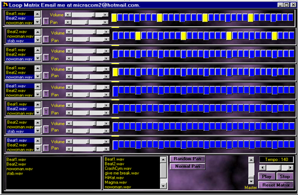



## Awave loop player

### Description

This program loops wave files by placeing them into buffers in a matrix kind of like a drum machine(see image). You can make beats and tunes quickly and easily though the matrix and samples are with the download. You can also skin the program when compiled. To complex to explain hear download it and please give your feedback this progam could be really good if people add more and keep posting it back on the planet.Please feel free to email me at micracom2@hotmail.com
 
### More Info
 
This program will only run if you have DirectX7 so if you do not it,s all over the web. Download it and install it my program should work then.

             |
---                |---
**Submitted On**   |2000-04-05 20:01:50
**By**             |[Jamie Pocock](https://github.com/Planet-Source-Code/PSCIndex/blob/master/ByAuthor/jamie-pocock.md)
**Level**          |Intermediate
**User Rating**    |4.8 (24 globes from 5 users)
**Compatibility**  |VB 5\.0, VB 6\.0
**Category**       |[Complete Applications](https://github.com/Planet-Source-Code/PSCIndex/blob/master/ByCategory/complete-applications__1-27.md)
**World**          |[Visual Basic](https://github.com/Planet-Source-Code/PSCIndex/blob/master/ByWorld/visual-basic.md)
**Archive File**   |[CODE\_UPLOAD4555452000\.zip](https://github.com/Planet-Source-Code/jamie-pocock-awave-loop-player__1-7036/archive/master.zip)

